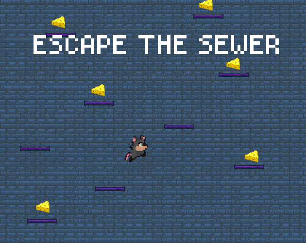

"Escape The Sewer" is a thrilling infinite jumper game where players navigate a challenging mouse by selecting directions, charging up jumps, and executing precise bounces off walls. Set in the depths of a sewer, players must calculate their ascent strategically, ensuring they land flawlessly on platforms scattered throughout the sewer's maze.

#### **HOW TO PLAY?**

WINDOWS: ARROWS KEY or Mouse Position, SPACE or Mouse (holds and release)  
TOUCH: TAP AND HOLDS on your left or right

Choose your directions wisely, calculate the jump charge and do the leap of faith! Note that The mouse (character) bounces off the wall, use that to land flawlessly.

#### Download the game to have the best and smoothest experience

#### [DOWNLOAD](https://keyyard.itch.io/escape-the-sewer)

.png) .png) .png) .png)
